A sample illustration of helm based installation of OCI OKE,based on artifact upload.

----------


ℹ️   Summary of Interactions

- Use OCI Service connector hub and invoke a function when there will be  repository artifiact upload event occurs.

- The Function will intern deploy the artifiact using helm to the OCI OKE.

- The whole interaction is encompassed inside a private Virtual cloud network subnet.


📗 Setup Dynamic groups 

-----------

1- A DG for functions .

rules 

```
resource.type = 'fnfunc'
resource.compartment.id = 'ocid1.compartment.oc1..xx'

```


2- A DG for Artifact repo.

rules

```
ALL {resource.type = 'artifactrepository', resource.compartment.id = 'ocid1.compartment.oc1..xx'}
```

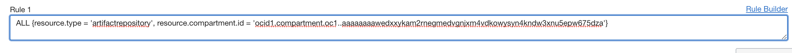


📗 Setup Policies 

-----------

1 - Policy for function access OKE.

```
Allow dynamic-group <FUNCTION DG NAME> to manage cluster-family in compartment <COMPARTMENT NAME>
```

2 - Policy for function to read artifact.

```
Allow dynamic-group <FUNCTION DG NAME> to read all-artifacts in compartment <COMPARTMENT NAME>
```

3 - Policy to associate service connector hub and functions.

```
allow any-user to use fn-function in compartment id <COMPARTMENT OCID> where all {request.principal.type='serviceconnector', request.principal.compartment.id='<COMPARTMENT OCID>'}

```

```
allow any-user to use fn-invocation in compartment id <COMPARTMENT OCID> where all {request.principal.type= 'serviceconnector', request.principal.compartment.id='<COMPARTMENT OCID>'}
```

📗 Setup OCI Artifact Registry repo. 

-----------

- Create an Artifact registry repo.
- Select or unselect mutable artifact options according your needs.

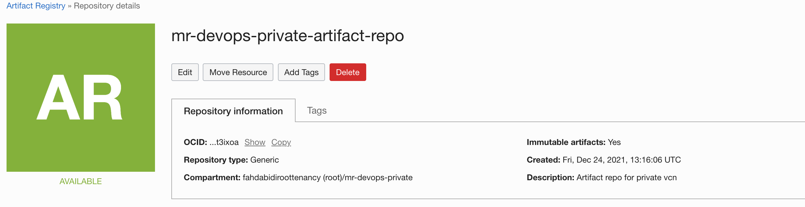

- Make a note of the repo's OCID.


📗 Setup an OCI OKE. 

-----------

- Create an OCI OKE Cluster.
- Here we are using Quick create work flow ,you may use Custom one if you would like to create OKE with in your Private subnets.
- Ensure to select **Private Endpoint / Private Worker** ,you may  use Public one as well.

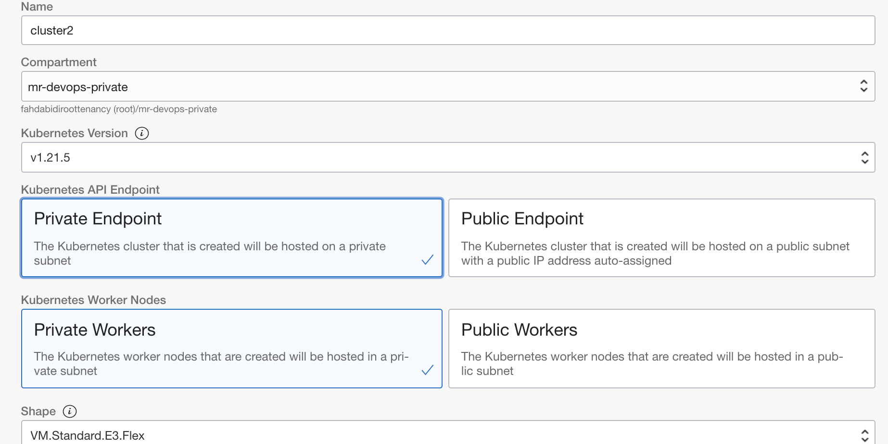

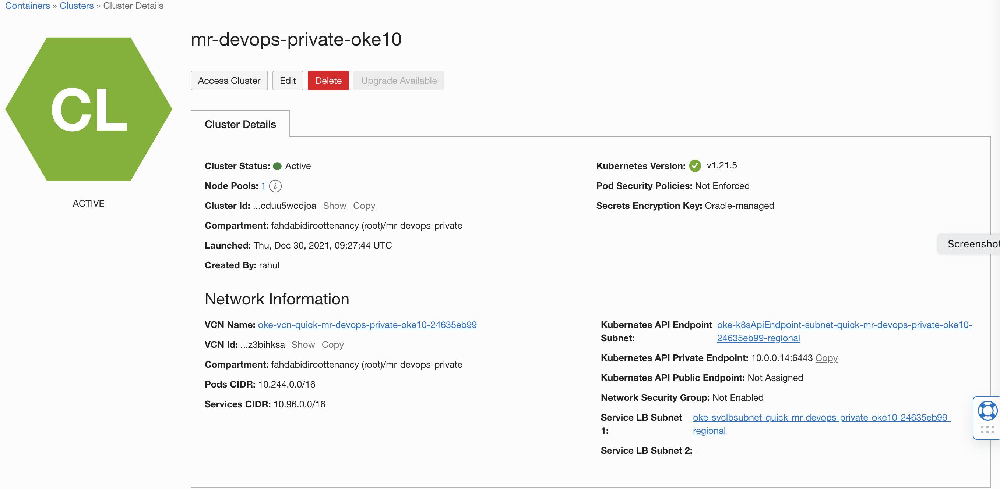


📗 Update VCN.

-----------

- As we have used the **OKE Quick Create** work flow ,it will create VCN and associated compartments.Incase if you are using custom flow ,update your VCN with respective configurations [- reference](https://docs.oracle.com/en-us/iaas/Content/ContEng/Concepts/contengnetworkconfigexample.htm#example-privatek8sapi-privateworkers-publiclb). 

- We will be using the Private subnet used for OKE node to use for functions ,to be with in the same private network.To do so follow the below configurations .

-  Use VCN > OKE Specific VCN > Click on oke-nodesubnet > Edit the Security rule > Add an ingress rule .This would helm our jump host to access /function to allow helm and kubectl access.

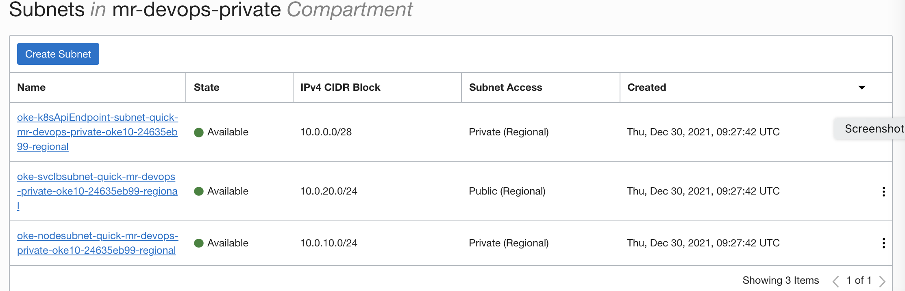


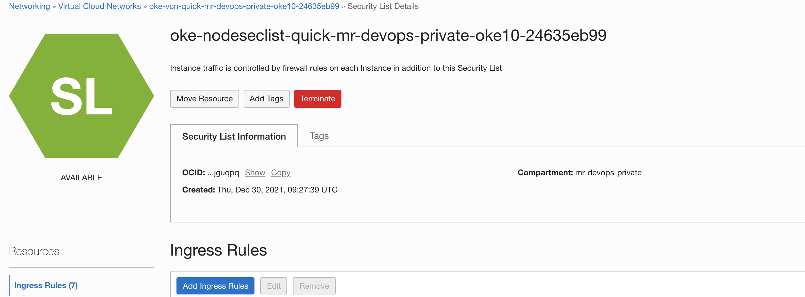

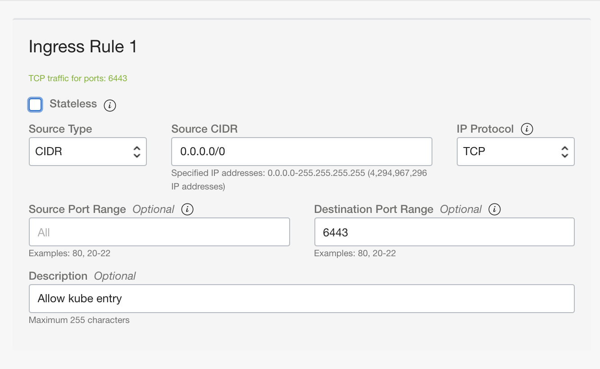


- Add an additional Ruting table entry to allow  the loadbalancer (we will be using public load balancer).To do so 

- Go to the VCN of OKE > Select Routing Table > Use Create Route Table 


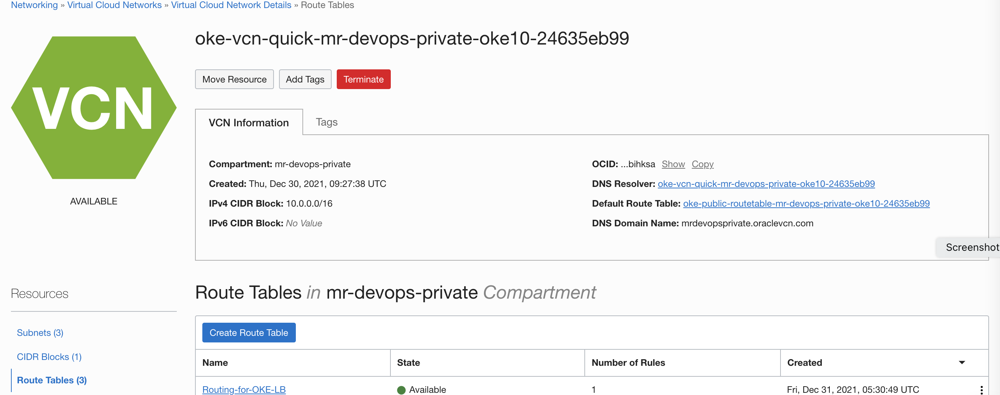

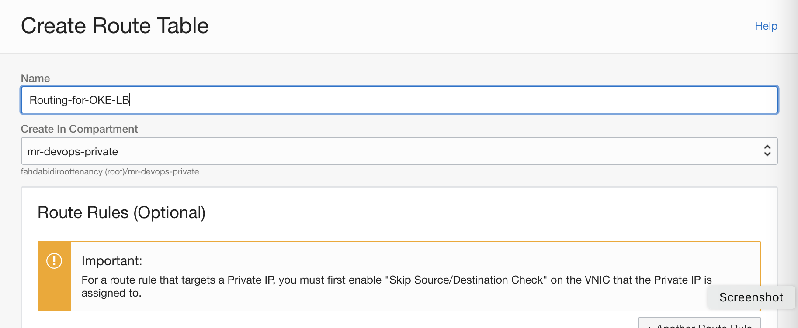

- Click the route table , and add a new Route Rules.Select the target type as *Internet Gateway*,select the default Internetgateway created byt he OKE Quick create flow ,if not select the custom one which you have created along with OKE VCN setups.


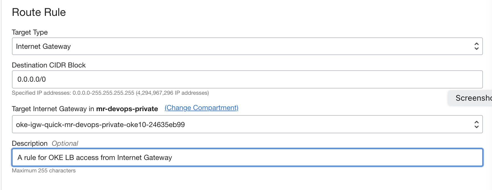


📗 Setup the Functions

-----------

- Create a function application,use the Private subnet of OKE nodesubet.Incase of custom OCI OKE flow , select possible private network with which the OKE and functions can communicate.

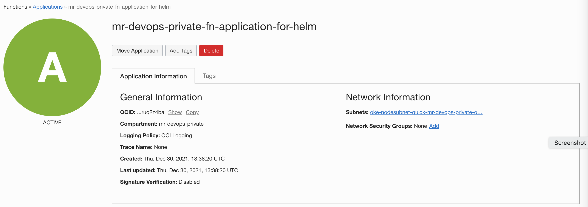

- Use the Application > Getting Started and setup the function context ,either on cloud shell or your local machine.

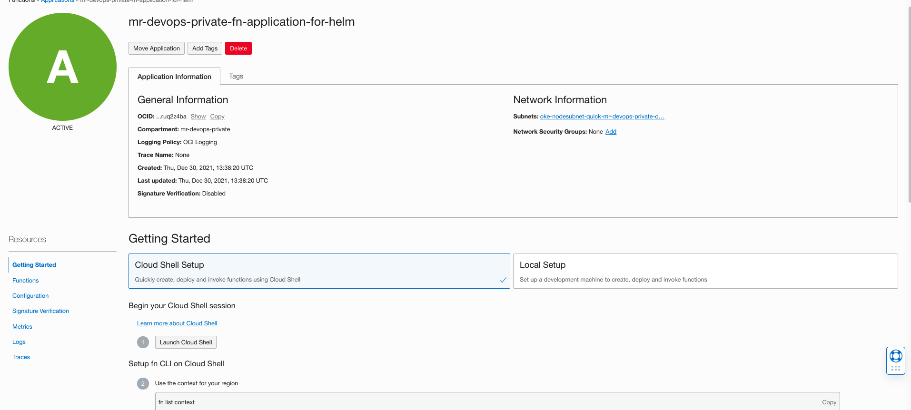

- Git clone and build the functions .

```
$ git clone https://github.com/RahulMR42/oci-helmdeploy-with-artifactrepo-and-functions
$ cd oci-helmdeploy-with-artifactrepo-and-functions
$ fn list apps (Valid the application name and context)
$ Update the func.yaml provide the region and oke cluster id.
$ fn deploy -v --app <FN APPLICATION NAME>
```

- Verify the functions via application > Functions view .


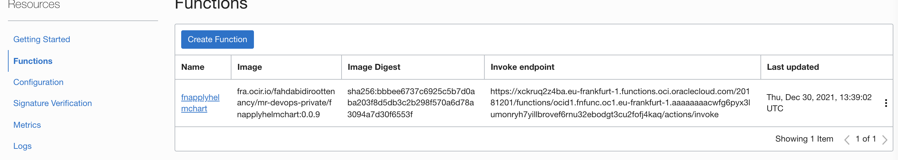

- Enable logs for the application via console.

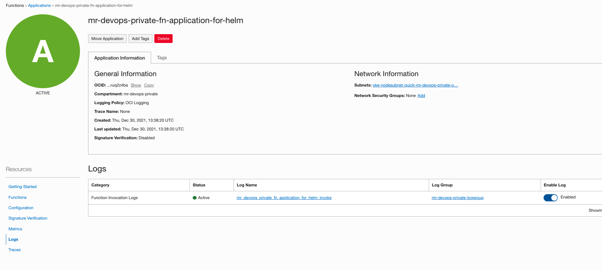


📗 Setup OCI Service Connector Hub 

-----------

- Create a service connector hub connecting artifact update/upload event and the functions that we just created.
- Select the source as Logging and target as Functions 

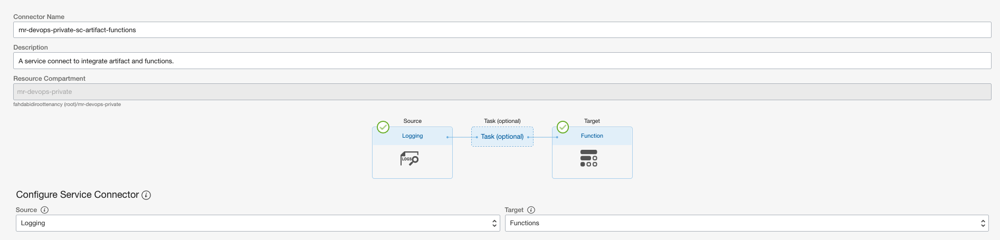

- In the configure source part ,select Artifact Registry and select the events are as Generic Artifact update /update by path and upload by path.

- Add an additional filter ,select the Attribute as source and enter * sample-fastapi.zip * .Here we using a wildcard selection with a name ,which will be used as a target path while we will be uploading the helm artifacts to OCI artifacts repo. 

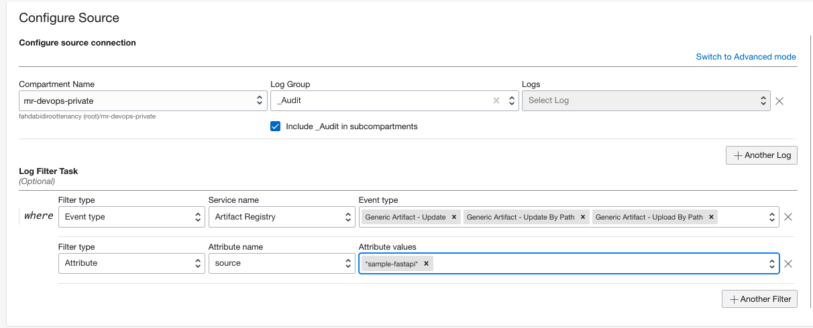

Or You may switch to Advance mode and paste the below query 

```
search "<OCI Compartment ID>/_Audit_Include_Subcompartment" | (type='com.oraclecloud.artifacts.updaterepository' or type='com.oraclecloud.artifacts.updategenericartifactbypath' or type='com.oraclecloud.artifacts.putgenericartifactcontentbypath' or type='com.oraclecloud.artifacts.updategenericartifact') and (source='*sample-fastapi.zip*')

```

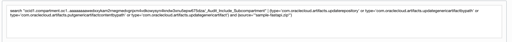

- Skip configure Tasks.
- At the target section select the application and functions.

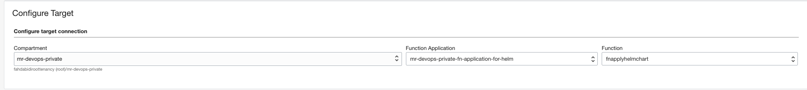


📗 Create a Bastion and a Jump hosts (Optional)

-----------

- Create an instance , use the private subnet used for functions (OKENODE SUBNET)
- Ensure to enable Oracle Cloud agent at the time of creation .
    - Refer the document [here](https://docs.oracle.com/en-us/iaas/Content/Compute/Tasks/manage-plugins.htm) and copy the inline script if the instance is not having an access to public yum repo.

    - Eg for Centos 8 as below,you can use the 'Show advanced option' and paste the inline script.

    ```

    #!/bin/sh
    cd ~
    curl -O https://objectstorage.us-phoenix-1.oraclecloud.com/p/-VOLFC0_me9TRHlsK9wLQihmRZe4-UjzinOrAvIORZhqZbPoH1P6cSocD1GFwvZW/n/imagegen/b/agents/o/oracle-cloud-agent-1.18.0-6194.el8.x86_64.rpm -v

    ```
    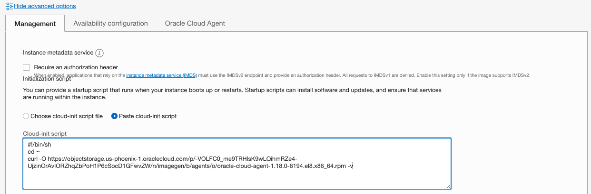

- Ensure the bastion plugin is enabled (If not enable it) and ensure its in 'Running State'. It would take a while/2 - 5 mnts in the first time.

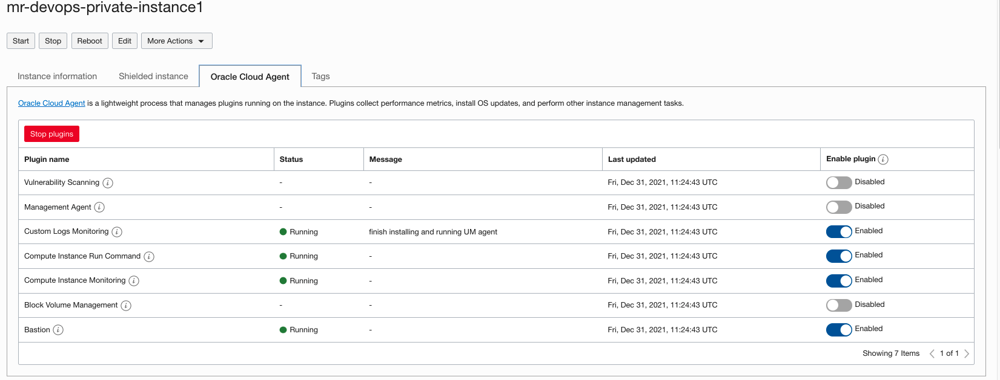


- Create an OCI bastion ,with this and the instance with Private network we will be able to check our OKE deployment using native commands.

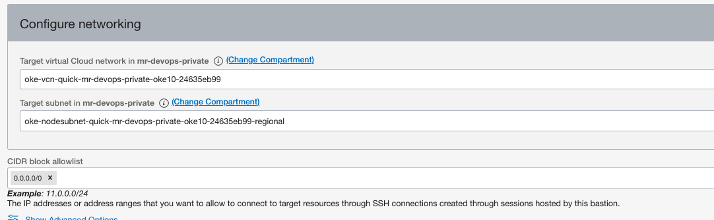

- Use the same subnet where we have function /instance and OKE node.

- Once the bastion is ready create a ssh port forwarding session.
    - Select the instance we created .
    - Add the correct ssh public key from a file or copy.

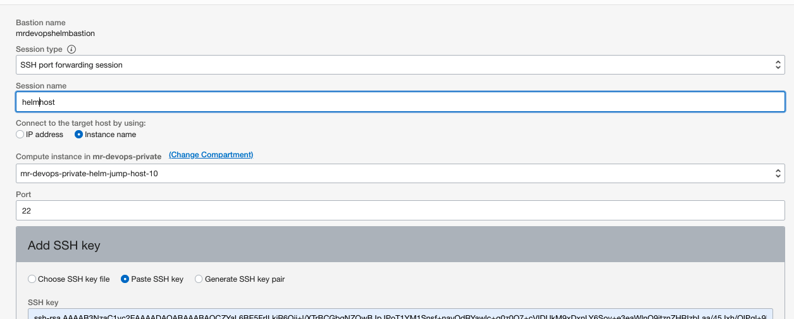

- Once it became active , use the 3 dots and copy the SSH command .

- Go to your local machine from where we would want to establish the connection ,open a terminal and paste the SSH command.
- You should provide the correct path to your ssh private key.

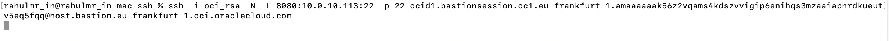

- If the session is ok ,it would stay with out any output ,with out closing the terminal ,open another one on your local machine.

```
ssh -i oci_rsa -p <LOCAL PORT USED IN THE ABOVE COMMAND> opc@localhost
```

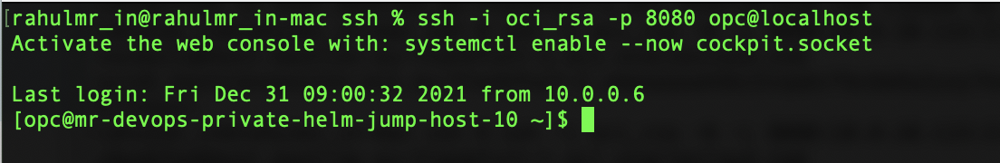

- Now you are in to the JUMP hosts.

-  Go back to the OCI OKE > Access Cluster and setup the machines 
- You need to install OCI CLI /follow the procedure and use the command given to get the access to OKE cluster.

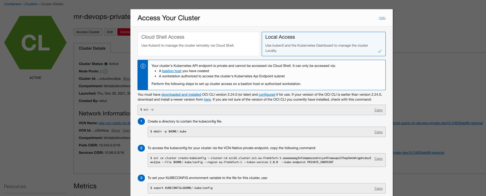

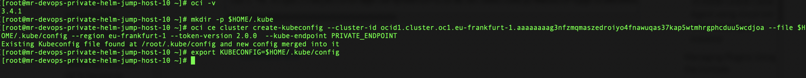

- It would ask information while configuring OCI CLI and please provide those (Tenancy ID /User ID / Region etc)

- Install kubectl and helm using the official documentation.

    -   https://kubernetes.io/docs/tasks/tools/install-kubectl-linux/ 
    -  Helm installation.

    ```
    export PATH=$PATH:/usr/local/bin; curl https://raw.githubusercontent.com/helm/helm/main/scripts/get-helm-3 | bash; mv /usr/local/bin/helm /usr/bin/helm
    ```

- Try to access the OKE cluster and validate .
- Incase of an error ,check your VCN placement / CIDRs / OKE setups etc.

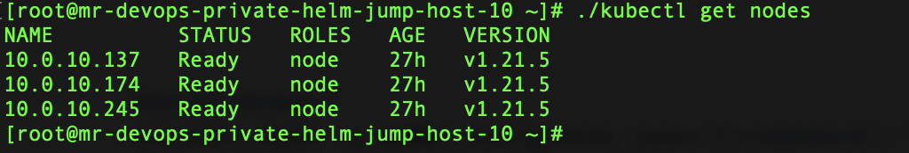


📗 Lets Test ..

-----------

📗 Setup OCI Artifact Registry repo. 

-----------


